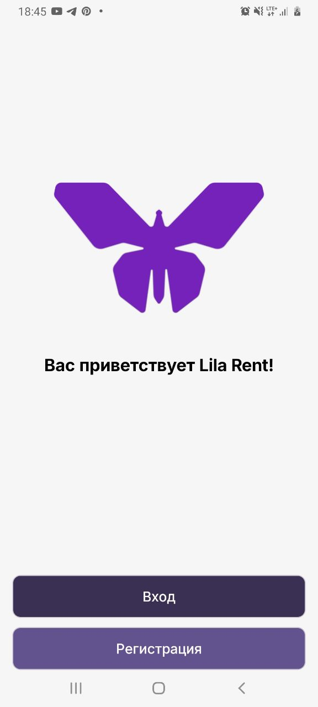
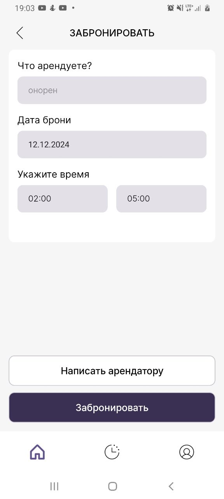
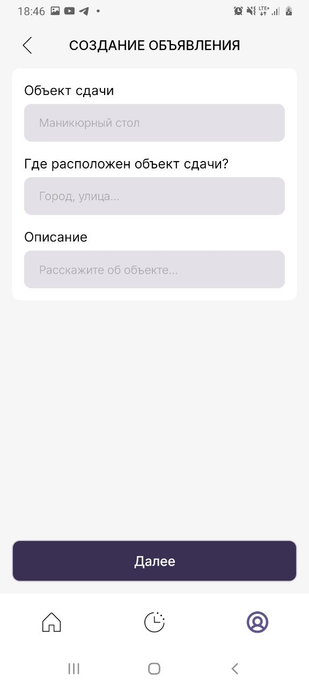
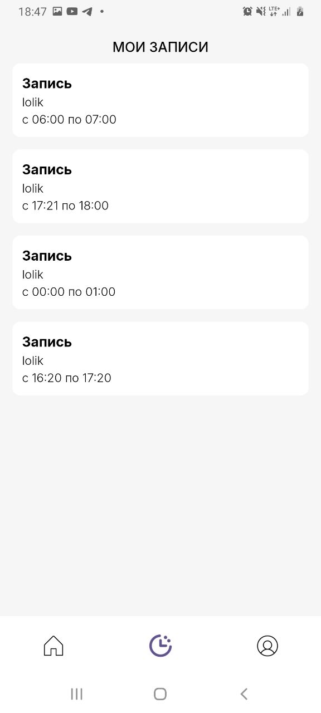

# Lila Rent User Guide

Welcome to **Lila Rent**, your all-in-one rental marketplace! This guide will help you navigate the app and make the most of its features, whether you're a renter or a landlord.

---

## Table of Contents

1. [Getting Started](#getting-started)
2. [Creating an Account](#creating-an-account)
3. [Booking Rentals](#booking-rentals)
4. [Creating an announcement](#creating-an-announcement)
5. [Managing Rentals](#managing-rentals)
6. [Managing Reservations](#managing-reservations)

---

## Getting Started

Lila Rent is available on both iOS and Android. Download the app from the App Store or Google Play Store and install it on your device.

### Launching the App

1. Open the app on your device.
2. On the landing screen, choose to either **Login** or **Register**.

## Creating an Account

1. Tap on **Register**.
2. Fill in your details:
   - Name
   - Login
   - Password
   - Phone Number
   - Email Address (optional)
3. Choose your legal entity type (legal person or individual)

## Booking Rentals

1. Select an announcement that interests you.
2. View the details, including price, availability, and additional information.
3. Tap **Book Now** to reserve the item.
4. Confirm your booking details.
5. Receive a confirmation message with booking details.

## Creating an Announcement

If you’re a owner, follow these steps to post a listing:

1. Go to the **My Profile** section from the main menu.
2. Tap **Create Announcement**.
3. Fill in the details:
   - Title
   - Description
   - Price
   - Location
   - Discount parameters
4. Upload photos of the item or property.
5. If you want to promote this announcement, fill payment details
6. Tap **Post** to publish your listing.

## Managing Rentals

### For Renters

- View your bookings under **My Rentals**.
- Cancel or modify bookings if allowed by the landlord.

### For Landlords

- Monitor your active listings under **My Listings**.
- Update details or deactivate listings when necessary.

_(Insert screenshot of the rental management section)_

---

## Managing Reservations

### For Owners

- View your bookings under **My Reservations**. Now you can see reservations for your announcements.

### For Individuals

- View your bookings under **My Reservations**. Now you can see your reservations.

Thank you for using Lila Rent! For further assistance, contact our support team at **support@lilarent.com**.

_(Insert app logo or branding image)_
